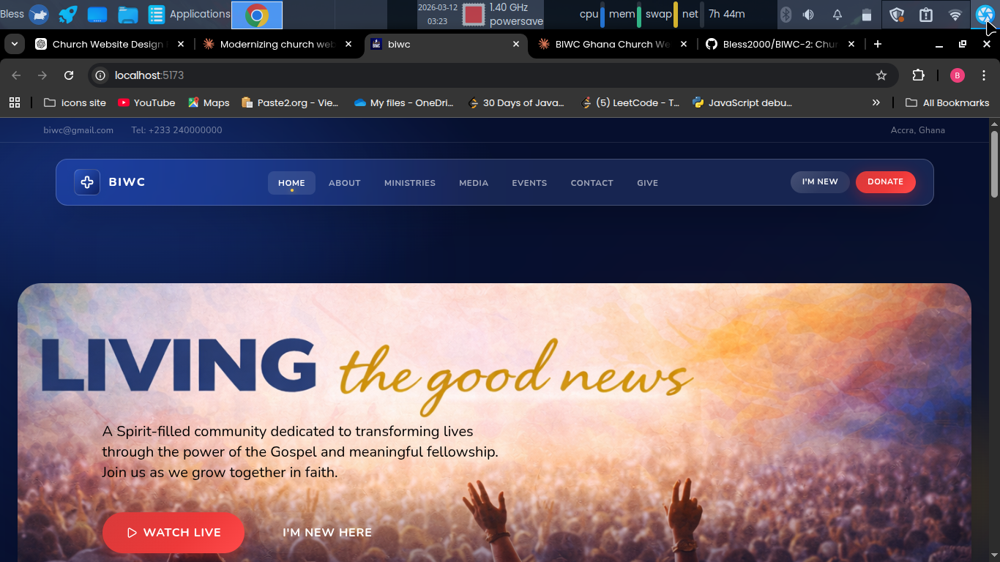

# BIWC Ghana – Digital Sanctuary



A modern, high-performance web platform for **Believers International Worship Center (BIWC) Ghana**. This project features a sophisticated **Glassmorphism Design System** tailored to create a reverent, immersive, and Spirit-filled digital experience.

## 🌟 Vision
To transform lives through the Good News of Jesus Christ by providing a seamless digital bridge between the physical sanctuary and the global community.

## 🎨 Design System: "Divine Glass"
The UI is built on a custom-engineered design system that prioritizes hierarchy, depth, and elegance:
- **Glassmorphism:** Semi-transparent surfaces with backdrop-blur for a premium, modern feel.
- **Dynamic Backgrounds:** Ambient floating orbs and mesh gradients that create a living atmosphere.
- **Typography:** 
  - **Cinzel:** For authoritative, classical headings.
  - **Cormorant Garamond:** For elegant, gold-italic accents.
  - **Nunito:** For approachable and highly legible body content.

## 🛠️ Tech Stack
- **Frontend:** [React 19](https://react.dev/)
- **Build Tool:** [Vite](https://vitejs.dev/)
- **Styling:** [Tailwind CSS v3](https://tailwindcss.com/) & PostCSS
- **Navigation:** [React Router 7](https://reactrouter.com/)
- **Icons:** [Lucide React](https://lucide.dev/)
- **Interactive UI:** [Swiper.js](https://swiperjs.com/) (Carousels)

## 📂 Architecture
The project follows a professional, scalable directory structure:
- `src/components/ui`: Atomic, reusable UI elements (Buttons, Cards, etc.)
- `src/components/layout`: Structural components (Navbar, Footer, MainLayout)
- `src/components/sections`: Large, complex homepage sections.
- `src/pages`: Individual page views.
- `src/styles`: Centralized design tokens and global CSS layers.
- `src/utils`: Reusable helpers and single-source-of-truth constants.

## 🚀 Getting Started

1. **Clone the repo:**
   ```bash
   git clone https://github.com/your-username/biwc.git
   ```

2. **Install dependencies:**
   ```bash
   npm install
   ```

3. **Start the development server:**
   ```bash
   npm run dev
   ```

## 📜 License
This project is for church ministry purposes. All rights reserved.
